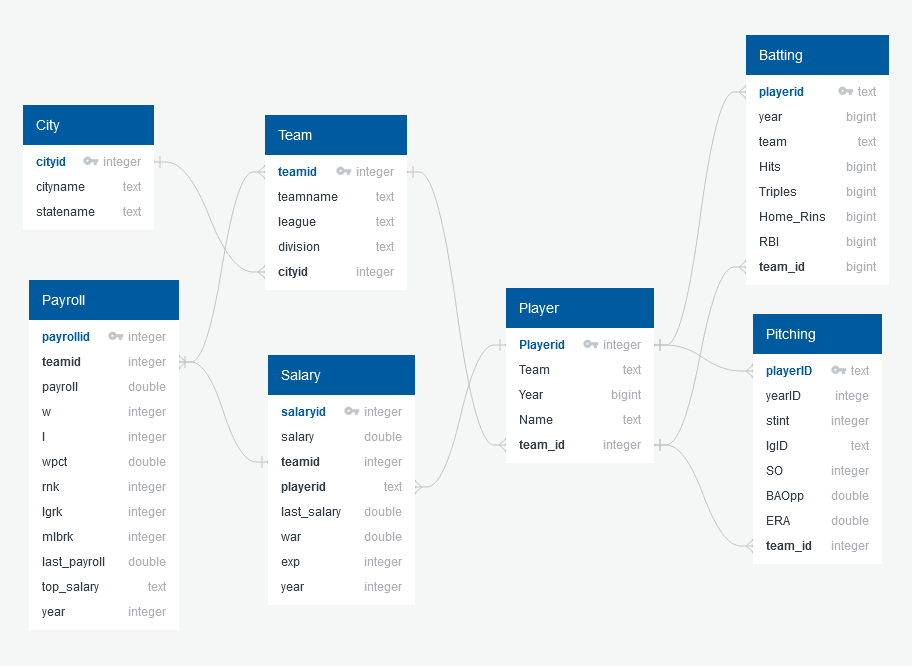
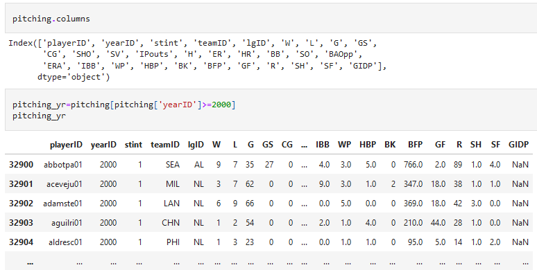
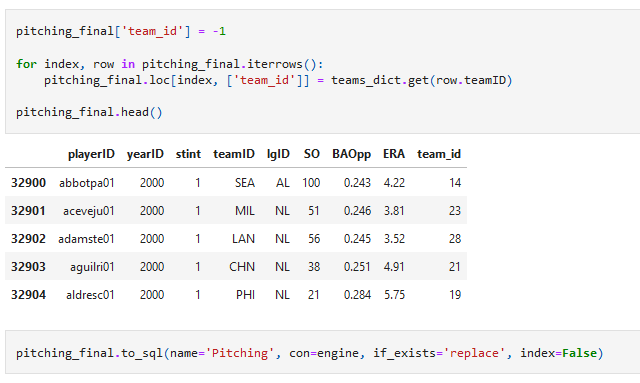

# Project_2_MLB_Stats_ETL

## Group 2:  

    Mcmullan, John
    Ortiz, Elena
    Page, Sarje 
    Dellinger, James 
    Gant, Juvante 
    Ariwodo, Michael 
    Basimamovic, Vedrana 
    Lampton, Jarvis 
    
    
   This project will deliver a database about Major League Baseball dated from 2000-2015. We performed the ETL process and create documentation which includes includes: 

    ● Datasets used and their sources 

    ● Types of data wrangling performed (data cleaning, joining, filtering, aggregating) 

    ● The schemata used in the final production database
    
   
 
 
We will use Python and Pandas for transformation, which can also be done with SQL or a specialized ETL tool. 
Teams is responsible for:
  - Citing the data sources
  - Extracting the data from those sources
  - Transforming the data (cleaning, joining, filtering, aggregating, etc.)
  - Loading the data into a database (relational or non-relational)

We will also prepare a report to address the following points:
  
 # **EXTRACT:** 
 
 First the following 7 data sources are loaded. (Your original data sources and how the data were formatted (CSV, JSON, pgAdmin4, etc.))

      1. Teams and Cities
           Worldatlas.com (https://www.worldatlas.com/articles/mlb-teams-and-their-cities.html) was our source for a list of 
           the current Major League Baseball teams and their cities.  The data resided in the html of a page on the website.
           We utilized BeautifulSoup in Jupyter Notebook to isolate and extract the team and city information from the html.           
      3. Pitching.csv 
      4. Batting.csv
      5. Payrolls.csv
      6. Salaries.csv
      7. 0519_baseball_reference.csv
  
  
 #  **TRANSFORM:**
  
  What data cleaning or transformation was required
  During the transformation process, we utilized jupyter notebook. 
  
  ## 1. Teams and Cities
     - Looped through the resulting rows of the html extract and built orm Team and City objects
     - Committed ORM objects to Postgresql tables.  
     - Subsequently, a query from each of the tables was saved as Teams.csv and Cities.csv to facilitate easier testing
     - Built a data dictionary of team names and abbreviations so other data sets could lookup the team ids

 ## 3. Pitching.csv 
     - Original Pitching.csv was loaded and stored in SQL Database
     - Then brought over to Jupyter Notebook for filtering (year) and cleaning (removed unusable columns)
     - Created relation to Teams file for team_id identification 
     - Stored clean csv file in database so only needed data can be queried 
     

 ## 4. Batting.csv
     - First took the Batting.csv and stored it as a SQL Database
     - Then brought it over to Jupyter Notebook
     - Queried only the data we needed
     
     

     - Then Group each stat by year, team and playerID to get total sums of each stat

     - And saved it as a new CSV called Batting_Stats.csv

 ## 5. Payrolls.csv

  Insert how it was transformed "\n"

  ## 6. Salaries.csv

  nsert how it was transformed

  
 #  **LOAD:** 
 
  The final database, tables/collections, and why this was chosen.

  
  The final database we used was postgreSQL

  test
 

## Sources:  

http://www.Kaggle.com (“MLB Players Dataset, from 2005 to 2019”,” Baseball Databank”) 
https://www.quickdatabasediagrams.com/  
https://www.thebaseballcube.com/  
https://www.worldatlas.com/articles/mlb-teams-and-their-cities.html

## Acknowledgments

This work is licensed under a Creative Commons Attribution-ShareAlike
3.0 Unported License. For details see:
http://creativecommons.org/licenses/by-sa/3.0/

Person identification and demographics data are provided by
Chadwick Baseball Bureau (http://www.chadwick-bureau.com),
from its Register of baseball personnel.

Player performance data for 1871 through 2014 is based on the
Lahman Baseball Database, version 2015-01-24, which is
Copyright (C) 1996-2015 by Sean Lahman.
